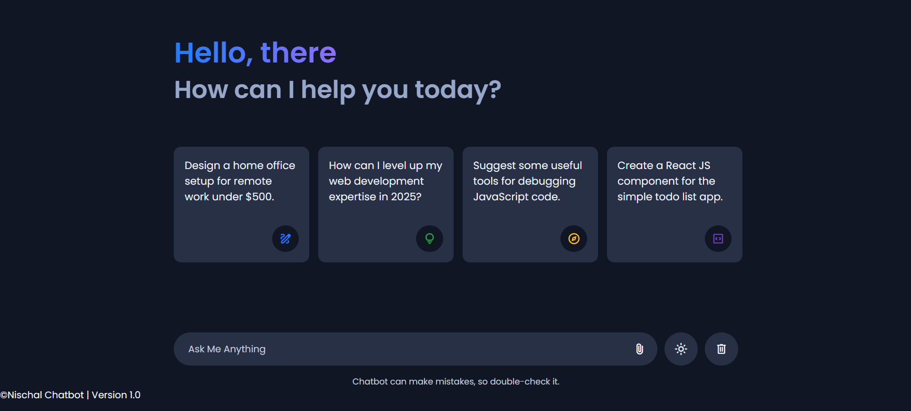

# Chatbot with FastAPI and Gemini-like UI

This project is a chatbot built using **FastAPI** for the backend and a **Gemini-like UI** for the frontend. The chatbot utilizes the GPT-2 model from Hugging Face's `transformers` library to generate responses.

## Features

- **FastAPI Backend**: Handles chatbot logic and response generation.
- **Gemini-like UI**: A sleek and modern user interface.
- **Typing Effect**: Bot responses appear with a typing animation.
- **File Upload Support**: Users can upload images, PDFs, etc.
- **Theme Toggle**: Light and dark mode support.
- **Responsive Design**: Works across desktop and mobile devices.

## Prerequisites

- Python 3.8 or later
- Node.js (optional, for running the frontend with Live Server)

## Installation and Setup

### 1. Clone the Repository

```bash
git clone https://github.com/your-username/your-repo-name.git
cd your-repo-name
```

### 2. Set Up the Backend

1. Install the required Python dependencies:
   ```bash
   pip install -r requirements.txt
   ```
2. Run the FastAPI server:
   ```bash
   cd backend
   uvicorn main:app --reload
   ```
   The backend will be available at `http://127.0.0.1:8000`.

### 3. Set Up the Frontend

1. Navigate to the `frontend` folder.
2. Open `index.html` using a Live Server extension or a browser.
3. The UI will be accessible at `http://127.0.0.1:5500/frontend/index.html`.

## Usage

- Type a message and press **Send** or **Enter**.
- The chatbot will generate and display responses.
- Toggle between **Light** and **Dark Mode**.

## Project Structure

```
your-repo-name/
├── backend/
│   ├── main.py                # FastAPI backend logic
│   └── requirements.txt       # Python dependencies
├── frontend/
│   ├── index.html             # UI structure
│   ├── styles.css             # Styling
│   ├── script.js              # Client-side logic
│   └── assets/                # Icons, images, etc.
├── README.md                  # Documentation
└── requirements.txt           # Backend dependencies
```

## Customization

- **Change Bot Logo**: Replace `assets/logo.png` in `frontend/` and update `script.js`.
- **Modify Theme Colors**: Edit `styles.css`.

## License

This project is licensed under the MIT License. See the [LICENSE](LICENSE) file for details.

## Acknowledgments

- [FastAPI](https://fastapi.tiangolo.com/) for the backend.
- [Hugging Face Transformers](https://huggingface.co/transformers/) for the chatbot model.
- [Google Fonts](https://fonts.google.com/) for UI enhancements.

---

### Screenshots

\
*Example of the chatbot interface*



---

## Deploy & Share

Once your project is on GitHub, share the repository link so others can contribute or use the chatbot.

---

Enjoy using the chatbot! 🚀
